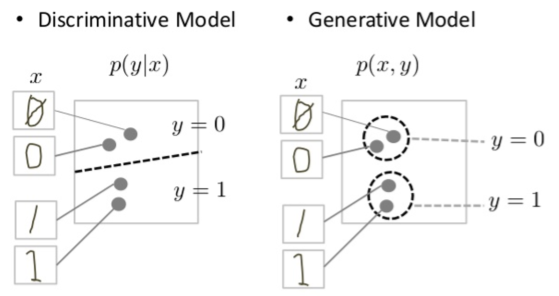
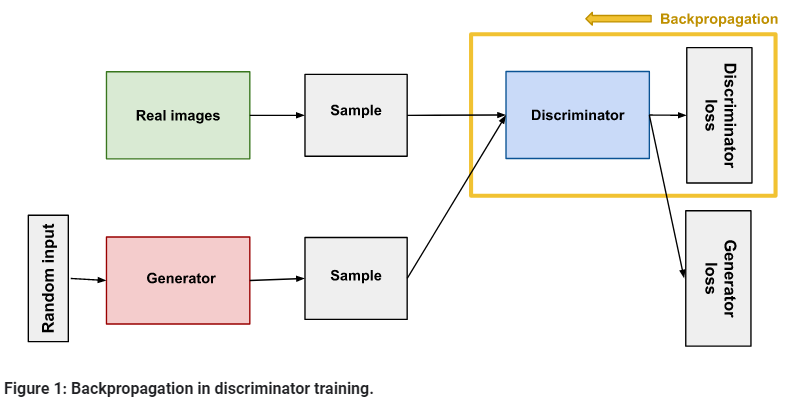
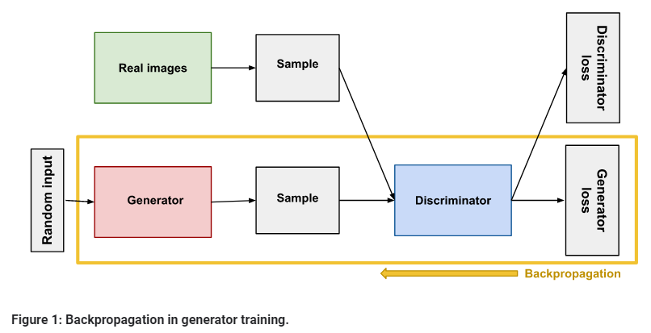

# Generative Adversarial Networks Notes

## What are GANs?
GANs are generative models: they create new data instances that resemble your training data. For example, GANs can create images that look like photographs of human faces, even though the faces don't belong to any real person.  
There are many kinds of generative model. GANs are just one kind of generative model.

## What is a generative model?
Informally:

* **Generative** models can generate new data instances.
* **Discriminative** models discriminate between different kinds of data instances.

## Generative Models are Hard
Generative models tackle a more difficult task than analogous discriminative models. Generative models have to model more.  
Discriminative models try to draw boundaries in the data space, while generative models try to model how data is placed throughout the space. For example, the following diagram shows discriminative and generative models of handwritten digits:
<!-- Image -->

    

The discriminative model tries to tell the difference between handwritten 0's and 1's by drawing a line in the data space. If it gets the line right, it can distinguish 0's from 1's without ever having to model exactly where the instances are placed in the data space on either side of the line.

In contrast, the generative model tries to produce convincing 1's and 0's by generating digits that fall close to their real counterparts in the data space. It has to model the distribution throughout the data space.

## Overview of GAN structure

A generative adversarial network (GAN) has two parts:

* The generator learns to generate plausible data. The generated instances become negative training examples for the discriminator.
* The discriminator learns to distinguish the generator's fake data from real data. The discriminator penalizes the generator for producing implausible results.

## The Discriminator

The discriminator in a GAN is simply a classifier. It tries to distinguish real data from the data created by the generator. It could use any network architecture appropriate to the type of data it's classifying.
<!-- Image -->

    

### Discriminator Training Data
The discriminator's training data comes from two sources:

* Real data instances, such as real pictures of people. The discriminator uses these instances as positive examples during training.
* Fake data instances created by the generator. The discriminator uses these instances as negative examples during training.  

In Figure 1, the two "Sample" boxes represent these two data sources feeding into the discriminator. During discriminator training the generator does not train. Its weights remain constant while it produces examples for the discriminator to train on.

### Training the Discriminator
The discriminator connects to two loss functions. During discriminator training, the discriminator ignores the generator loss and just uses the discriminator loss.

During discriminator training:

* The discriminator classifies both real data and fake data from the generator.
* The discriminator loss penalizes the discriminator for misclassifying a real instance as fake or a fake instance as real.
* The discriminator updates its weights through backpropagation from the discriminator loss through the discriminator network.

## The Generator
The generator part of a GAN learns to create fake data by incorporating feedback from the discriminator. It learns to make the discriminator classify its output as real.
<!-- Image -->

    

### Random Input
Neural networks need some form of input. Normally we input data that we want to do something with, like an instance that we want to classify or make a prediction about. But what do we use as input for a network that outputs entirely new data instances?

In its most basic form, a GAN takes random noise as its input. The generator then transforms this noise into a meaningful output. By introducing noise, we can get the GAN to produce a wide variety of data, sampling from different places in the target distribution.

Experiments suggest that the distribution of the noise doesn't matter much, so we can choose something that's easy to sample from, like a uniform distribution. For convenience the space from which the noise is sampled is usually of smaller dimension than the dimensionality of the output space.

### Using the Discriminator to Train the Generator
To train a neural net, we alter the net's weights to reduce the error or loss of its output. In our GAN, however, the generator is not directly connected to the loss that we're trying to affect. The generator feeds into the discriminator net, and the discriminator produces the output we're trying to affect. The generator loss penalizes the generator for producing a sample that the discriminator network classifies as fake.

This extra chunk of network must be included in backpropagation. Backpropagation adjusts each weight in the right direction by calculating the weight's impact on the output — how the output would change if you changed the weight. But the impact of a generator weight depends on the impact of the discriminator weights it feeds into. So backpropagation starts at the output and flows back through the discriminator into the generator.

At the same time, we don't want the discriminator to change during generator training. Trying to hit a moving target would make a hard problem even harder for the generator.

So we train the generator with the following procedure:

1. Sample random noise.
2. Produce generator output from sampled random noise.
3. Get discriminator "Real" or "Fake" classification for generator output.
4. Calculate loss from discriminator classification.
5. Backpropagate through both the discriminator and generator to obtain gradients.
6. Use gradients to change only the generator weights.

This is one iteration of generator training.

## GAN Training
Because a GAN contains two separately trained networks, its training algorithm must address two complications:

* GANs must juggle two different kinds of training (generator and discriminator).
* GAN convergence is hard to identify.

Alternating Training
The generator and the discriminator have different training processes. So how do we train the GAN as a whole?

### GAN training proceeds in alternating periods:

1. The discriminator trains for one or more epochs.
2. The generator trains for one or more epochs.
3. Repeat steps 1 and 2 to continue to train the generator and discriminator networks.

We keep the generator constant during the discriminator training phase. As discriminator training tries to figure out how to distinguish real data from fake, it has to learn how to recognize the generator's flaws.

Similarly, we keep the discriminator constant during the generator training phase. Otherwise the generator would be trying to hit a moving target and might never converge.

### Convergence
As the generator improves with training, the discriminator performance gets worse because the discriminator can't easily tell the difference between real and fake. If the generator succeeds perfectly, then the discriminator has a 50% accuracy. In effect, the discriminator flips a coin to make its prediction.  
This progression poses a problem for convergence of the GAN as a whole: the discriminator feedback gets less meaningful over time. If the GAN continues training past the point when the discriminator is giving completely random feedback, then the generator starts to train on junk feedback, and its own quality may collapse.

For a GAN, convergence is often a fleeting, rather than stable, state.