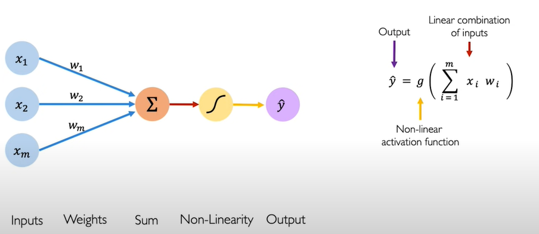

# Deep Learning Notes

## Why Deep Learning?
Traditionally machine learning algorithms define a set of features in their data. Usually these are features that are hand-crafted and thus they tend to be pretty brittle in practice when they are deployed. 
Deep learning aims to learn these features directly from data in a **hierarachical** manner.

## The perceptron
> The structural building block of deep learning

### Forward Propagation
<!-- Image -->

    

