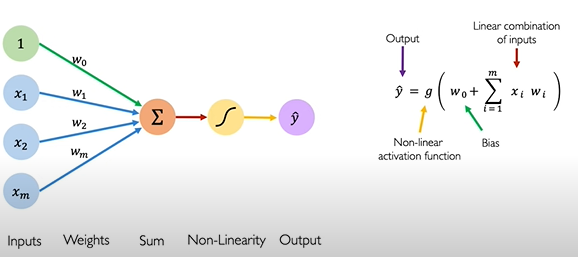

# Deep Learning Notes

## Why Deep Learning?
Traditionally machine learning algorithms define a set of features in their data. Usually these are features that are hand-crafted and thus they tend to be pretty brittle in practice when they are deployed. 
Deep learning aims to learn these features directly from data in a **hierarachical** manner.

## The perceptron
> The structural building block of deep learning.

### Forward Propagation
<!-- Image -->

    

Each of these inputs are multiplied by their corresponding weights and then added together. We then take this single number as a result of that addition, add a bias to it and pass it through a non-linear activation function to produce our final output y.

### Common Activation Functions
<!-- Image -->

    

The sigmoid activation function takes any value and outputs a number between 0 and 1. This makes it very well suited for probability problems.

### Importance of Activation Functions
> The purpose of activation functions is to introduce non-linearities into the network.

<!-- Image -->

    

In the real world, data is almost always non-linear. Using a neural network with a linear activation function is like trying to separate the red and green dots with a single straight line.

### Why are loss functions difficult to optimise?

The gradient tells us which direction to step next, while the learning rate controls the magnitude of that next step. (eg. how much to step in the direction of that gradient)
A learning rate that is too small converges slowly and gets stuck in false local minima.
A learning rate that is too large can overshoot the global minima and become unstable, never converging.
An optimal learning rate has to be large enough to avoid the local minima but small enough so that they can converge on the global minima.